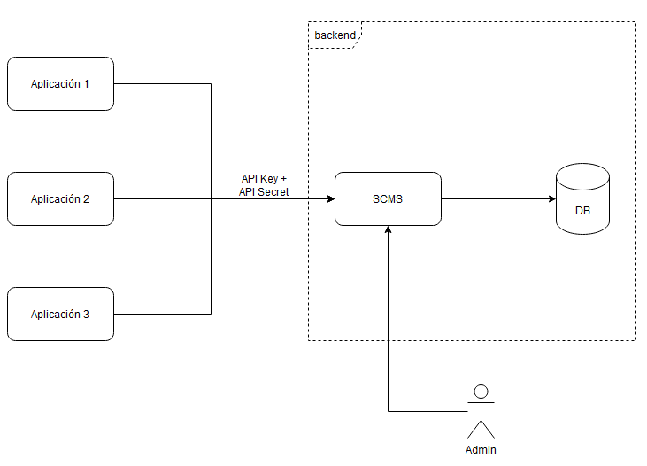

# Challenge 1 - Super Configuration Management System (SCMS)

## Intro

Esta actividad consiste en desarrollar un servicio web REST que nos permita administrar la configuración de distintas aplicaciones en un sistema centralizado.

La idea sería que un operador (administrador en principio) pueda registrar distintas Aplicaciones y asociarles uno o más Ambientes, a los cuales se le podrán agregar registros de configuración (similares a los que se guardan en un archivo application.properties).

Estos valores de configuración deberán poder ser consultados por cada Aplicación registrada mediante una integración REST usando credenciales que se le asignen dentro de nuestro sistema.

*Aclaración: No vamos a trabajar en estas integraciones, sólo en el sistema que gestiona las configuraciones para las aplicaciones.*

Representación del sistema:


Ejemplo:

	El administrador registra en SCMS la Aplicación 'Blog' y le crea un Ambiente 'desarrollo'. Luego le agrega a este Ambiente dos registros de configuración:
	{
		"config-1":"valor-1",
		"config-2":"valor-2"
	}
	El administrador le comparte las credenciales generadas por el sistema (API Key + API Secret) al responsable de 'Blog', quien procede a realizar una integración con SCMS.
	Esta integración consistirá en ejecutar una consulta de configuración usando las credenciales provistas.
	Por ejemplo podríamos hacer algo de la forma: 'GET https://scms.flexia.com.ar/apps/1/env/2/configuration' para obtener las configuraciones de la Aplicación con ID 1 y el Ambiente con ID 2.

## Requerimientos

Se deberán implementar los siguientes requerimientos funcionales mínimos:

- El sistema debe tener al menos un administrador, idealmente con la posibilidad de agregar más.

- El administrador deberá poder crear Aplicaciones, indicando al menos un nombre y una descripción para la misma.

- El administrador deberá poder crear uno o más Ambientes asociados a una Aplicación. Cada ambiente deberá tener nombre y descripción.

- El administrador deberá poder agregar uno o más registros de configuración a un Ambiente. Además, deberá poder editarlos o eliminarlos.
Aclaración: Un registro de configuración consiste en una entrada clave valor, podemos pensarlo como un archivo de properties pero almacenado en este sistema.

Algunas configuraciones de ejemplo:
```json
{
	"my-db.url": "jdbc:postgresql://localhost:5432/my_example_db",
	"external-api.token": "yJ0eXAiOiJKV1QiLCJhbGciOiJIUzUxMiJ9.eyJzdWIiOiIxIiwibmFtZSI6ImFkbWluIiwiZXhwIjoy",
	"enable-validations": "true"
}
```

- Un Ambiente deberá asociarse a una API Key (identificador público) y un API Secret (clave secreta) al momento de ser creado. 
El API Secret deberá ser almacenado de forma segura, ya que es equivalente a un password.

Ejemplos:
```
# API Key
d6d0060f-ab85-416a-8cc7-d6a4b3a7c3e2
# API Secret (Previo a encoding)
1c81c250-142d-47f6-bd24-4d626670821f
```

- Cada aplicación registrada en el sistema deberá poder consultar sus parámetros de configuración para un determinado ambiente mediante el uso de sus credenciales (API Key + API Secret).
Estas credenciales idealmente deben viajar como headers HTTP en el request.


## Algunas sugerencias:

- Para poder generar una API Key y un API Secret para cada Ambiente nuevo, podemos usar [UUIDs](https://www.baeldung.com/java-uuid#4-version-4).
Ejemplo:
```java
String randomUUID = UUID.randomUUID().toString();
```

- Para almacenar de forma segura el API Secret podemos aprovechar el PasswordEncoder requerido por Spring Security (El mismo que usamos para encoding de passwords)


## Lineamientos a respetar:

El servicio debe consistir de una API REST utilizando lo siguiente:
- Spring Boot
- Spring Web (REST Controllers)
- Spring Security
- Spring Data JPA (+H2)
- JWT para autenticación
- Documentación de interfaz con Swagger / OpenAPI
- Configuración de ambientes "local" y "development" en base a archivos application.properties

</hr>

# Dudas planteadas y sus respuestas

# 1 - Cómo diferenciar la autenticación de administradores de la de aplicaciones
Edu planteó cómo distinguir métodos de autenticación a nivel configuración de Spring Security. Básicamente porque en el challenge 1 existe un login de administradores y la posibilidad alternativa de usar API Key + API Secret por parte de las Aplicaciones.
Esto puede resolverse de varias formas:

1 - Implementar un nuevo filter, teniendo como resultado final dos filters (JWT + APIKey). Esto podemos incorporarlo a la config de seguridad como en el siguiente ejemplo:
```java
// [...]
.and().addFilter(jwtFilter()).addFilter(apiKeyFilter())
// [...]
```

2 - Acceder a nivel controller a los headers HTTP de alguna forma, haciendo que nuestro método o métodos estén excluídos de la configuración de seguridad (ya que estaríamos realizando las validaciones directamente en los métodos).

Esto puede lograrse inyectando información de la request en el método en particular donde sea que la necesitemos. Esto podemos ver cómo se hace [acá](#acceso-a-headers-http)
	
En este escenario vamos a tener que verificar API Key + API Secret en cada método en el que los requiramos de forma manual.


## Acceso a Headers HTTP
1 - Inyectar el HttpServletRequest (javax.servlet.http.HttpServletResponse).

Vimos algo similar cuando tuvimos que inyectar el response HTTP para poder agregar el header de registros totales de paginado en el proyecto posts de la app blog (En la clase ar.com.flexia.posts.api.controller.PostController).

2 - Inyectar el header en particular que deseamos mediante el uso de la Annotation org.springframework.web.bind.annotation.RequestHeader:
```java
public Object myMethod(@RequestHeader("my-http-header") String headerValue) {
	// hacer algo
	return new Object();
}
```

3 - Inyectar todos los headers recibidos mediante el uso de la Annotation org.springframework.web.bind.annotation.RequestHeader y definiendo un parámetro del tipo org.springframework.http.HttpHeaders:
```java
public Object myMethod(@RequestHeader HttpHeaders  allHttpHeaders) {
	// Importante: tener en cuenta que los headers pueden ser multivariados (devolver una lista)
	List<String> values = allHttpHeaders.getOrEmpty("my-http-header");
	// hacer algo
	return new Object();
}
```

Pueden leer un poco más en detalle sobre estas alternativas en este [link](https://www.baeldung.com/spring-rest-http-headers)